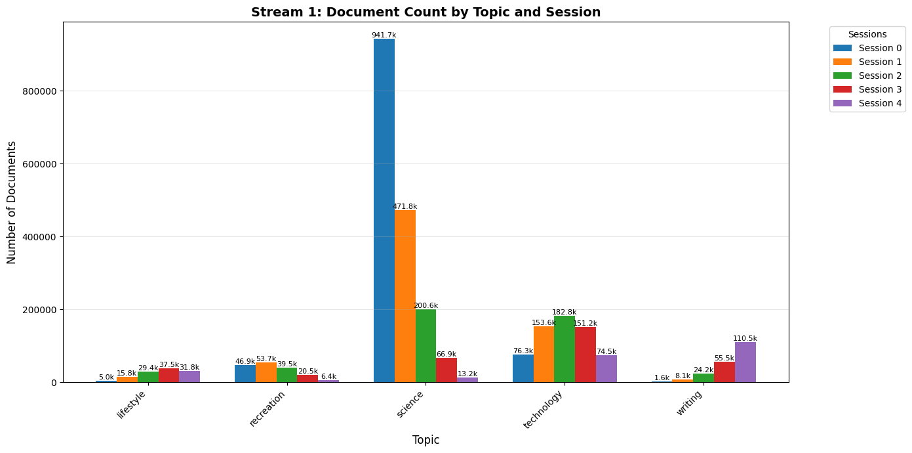
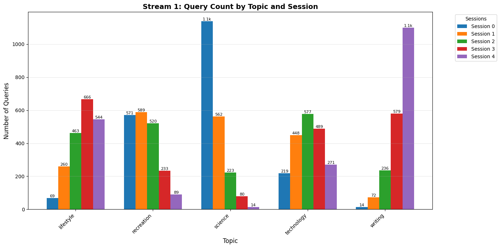
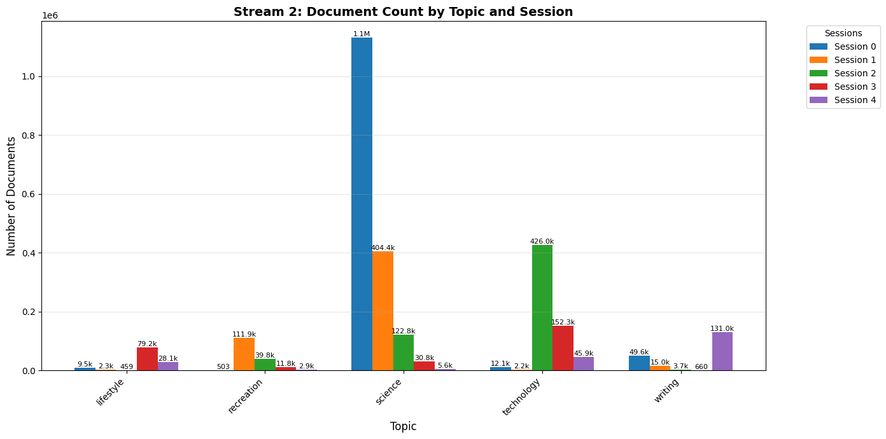
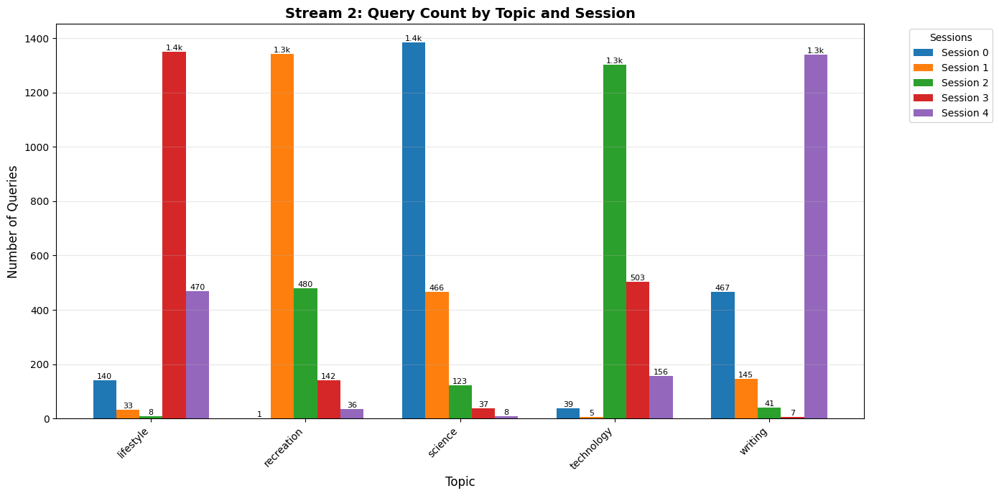
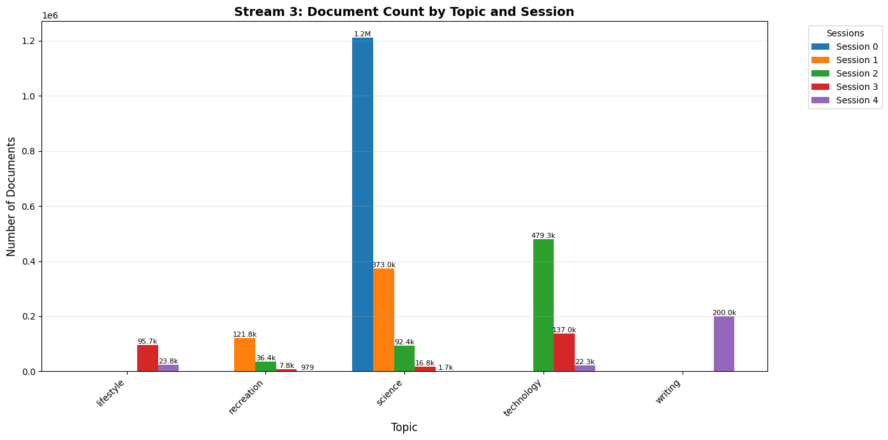
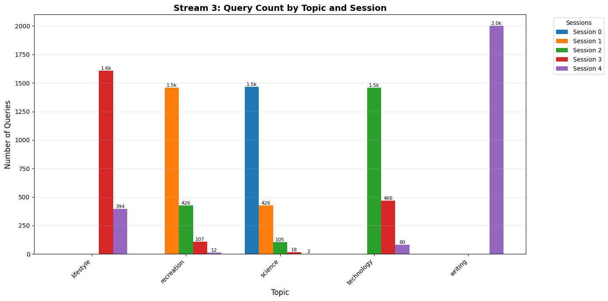

## Dataset

The experiments use the **LOTTE streaming dataset** ([lotte-streams-for-murr](https://huggingface.co/datasets/hltcoe/lotte-streams-for-murr)):

```
lotte-streams-for-murr/
├── docs/
│   └── test_D{stream}_{session}.parquet   # Documents (parquet, cols: docid, text)
├── queries/
│   └── test_D{stream}_{session}.jsonl     # Queries (jsonl, fields: query_id, text)
└── qrels/
    └── test_D{stream}_{session}.qrels     # Relevance judgments (TREC format)
```

- **3 streams**: D1, D2, D3
- **5 sessions per stream**: 0, 1, 2, 3, 4
- Each session adds new documents and queries; evaluation is cumulative.

### Dataset Composition

The following visualizations show the distribution of documents and queries across topics and sessions for each stream:

**Stream 1:**
| Documents | Queries |
|-----------|---------|
|  |  |

**Stream 2:**
| Documents | Queries |
|-----------|---------|
|  |  |

**Stream 3:**
| Documents | Queries |
|-----------|---------|
|  |  |

Note that the *science* topic dominates the dataset, while other topics have fewer documents and queries. Each session cumulatively adds more data from each topic.

### Pre-Encoded Metadata Files

To speed up experiments, queries and documents are pre-encoded once and their file paths stored in metadata JSON files. These are then later organized by stream, session, and model version (old vs. new):

See [metadata_streaming_splade.json](metadata_streaming_splade.json) for a full example.

**File structure**:
```json
{
  "queries": {
    "[stream_id]": {
      "[session_id]": {
        "old": "path/to/queries_D[stream]_[session]_old.jsonl",
        "new": "path/to/queries_D[stream]_[session]_new.jsonl"
      }
    }
  },
  "documents": {
    "[stream_id]": {
      "[session_id]": {
        "old": "path/to/docs_D[stream]_[session]_old.jsonl",
        "new": "path/to/docs_D[stream]_[session]_new.jsonl"
      }
    }
  }
}
```

**Fields**:
- `queries` / `documents`: Top-level grouping by content type
- `[stream_id]`: Stream number (1, 2, or 3)
- `[session_id]`: Session number (0, 1, 2, 3, or 4)
- `old` / `new`: Paths to JSONL files encoded with old vs. new model

---

## Experiment Workflow

The experiments follow this pipeline:

```
1. Encode documents & queries to JSONL
      └── bc/streaming/encode_single_file_sparse.py  (sparse models)

3. Run streaming experiments
      └── Sparse baselines (switch at session X)
           └── bc/streaming/search_streaming_sparse.py
```

---

## Encoding Documents & Queries

**Before running streaming experiments**, encode all documents and queries using the old and new models. 

### Quick Example: Sparse Encoding

```bash
# Encode documents with sparse model
python bc/encode_single_file_sparse.py \
  --model_name naver/splade-v3-tiny \
  --input_file /path/to/lotte-streams-for-murr/docs/test_D1_0.parquet \
  --output_dir /path/to/encoded_docs \
  --batch_size 128 \
  --device cuda
```

**Supports**:
- `--model_name`: Any SPLADE model or compatible sparse encoder
- `--input_file`: Parquet files (docs) or JSONL files (queries)
- `--output_dir`: Where to save encoded JSONL files
- `--batch_size`: Increase for GPU memory; decrease for CPU
- Output: Sparse JSONL with token IDs and weights

### Generate Metadata

After encoding all files, create a manifest:

```bash
python bc/generate_metadata.py \
  --encoded_docs_dir /path/to/encoded_docs \
  --encoded_queries_dir /path/to/encoded_queries \
  --output_metadata metadata_streaming_splade.json
```

This metadata file is used by `search_streaming_sparse.py` and `search_streaming_dense.py` to locate pre-encoded embeddings (no re-encoding during experiments).

---

## SLURM Script Reference

---

### 1. SLURM array script with status tracking
**Purpose**: Runs a set of switching-experiment baselines as a SLURM array job with per-job status tracking (STARTED / SUCCESS / FAILED status files and per-task logs).  
**Script called**: `bc/streaming/search_streaming_new.py` — see [test.sh](../../bash/bash_stream_eval/test.sh) for a minimal example call.  


**Key configuration variables inside the script** (edit before submitting):

| Variable | Description | Example |
|----------|-------------|---------|
| `BASELINES` | Array of baselines to run (indexed by `SLURM_ARRAY_TASK_ID`) | `(baseline6_1 baseline6_2 … baseline23_4)` |
| `STREAM` | Which stream to evaluate | `1` |
| `METADATA_PATH` | Path to metadata JSON | `metadata_streaming_splade-tiny_splade-v3.json` |
| `OUTPUT_ROOT` | Where results are saved | `/path/to/streaming_results/...` |
| `LOG_ROOT` | Where per-task logs are written | `/path/to/logs/...` |
| `STATUS_DIR` | Where `.status` tracking files are written | `/path/to/status/...` |

Encodings must already exist (`--skip_encoding` is always passed). Status files in `STATUS_DIR` let you monitor or resume individual array tasks.

---

### 2. Simplified sparse streaming runner

See [test.sh](../../bash/bash_stream_eval/test.sh) for a minimal example.


---

## Output Structure

Results are organized as:

```
output/
└── {baseline_name}/
    ├── overall_summary.json       # Aggregated metrics across all streams
    └── stream_{1,2,3}/
        ├── summary.json           # Per-stream macro-average Success@5
        └── session_{0,1,2,3,4}/
            ├── results.trec       # TREC-format ranked results
            ├── metrics.json       # nDCG@10, Success@5, RR@10
            └── id_validation.json # Document ID coverage check
```


